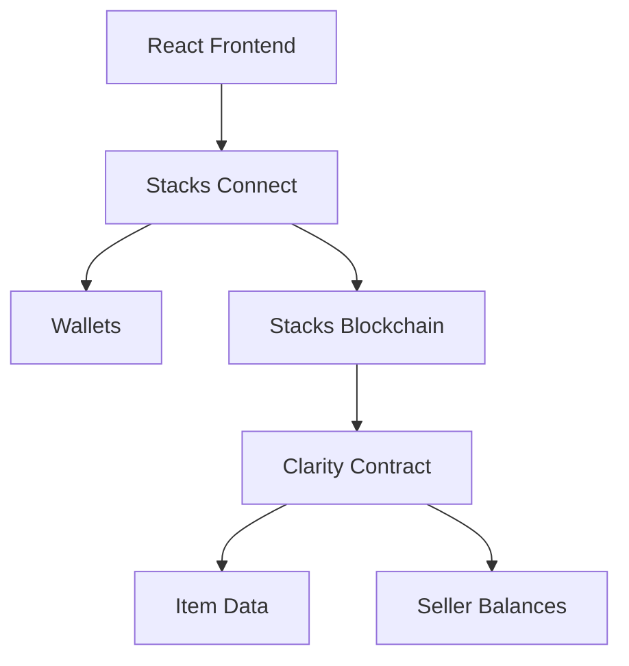
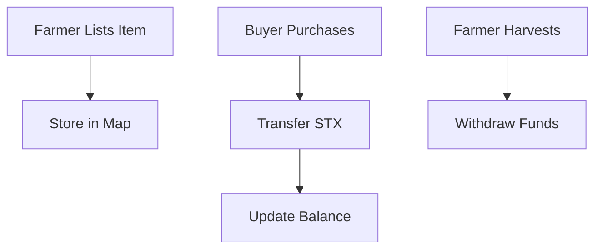

# SatoshiFarm

**Revolutionizing Agriculture with Bitcoin's Power**

A cutting-edge decentralized marketplace where farmers meet buyers directly on the Stacks blockchain. No middlemen, instant payments, and farm-fresh transparency powered by Bitcoin L2 technology.

[](https://stacks.co)
[](https://clarity-lang.org)
[](https://reactjs.org)

## What's SatoshiFarm?

Imagine a world where farmers sell their harvest directly to consumers, getting paid instantly in STX without any platform fees. That's SatoshiFarm - a trustless marketplace built on Bitcoin's most advanced Layer 2 solution.

### Key Features

- **Instant Payments**: Direct STX transfers from buyer to farmer
- **Fresh Inventory**: Real-time stock tracking and automatic deactivation
- **Transparent Earnings**: Live balance tracking with one-click withdrawals
- **Enterprise Security**: Atomic transactions with input validation
- **Wallet Freedom**: Connect Leather, Xverse, or any WalletConnect wallet
- **Beautiful UI**: Modern design that works on any device

## Architecture at a Glance

### System Overview


### Smart Contract Flow


## Quick Start

### Prerequisites
- Node.js 18+
- Stacks wallet (Leather, Xverse, or mobile)

### Get It Running

```bash
# Clone the magic
git clone <your-repo-url>
cd satoshi-farm

# Install dependencies
npm install

# Get your WalletConnect ID from https://cloud.reown.com
# Create .env file
echo "VITE_WALLETCONNECT_PROJECT_ID=your_id_here" > .env

# Launch the app
npm run dev
```

Visit `http://localhost:8080` and connect your wallet!

## Smart Contract Deep Dive

**Live on Testnet**: `STGDS0Y17973EN5TCHNHGJJ9B31XWQ5YXBQ0KQ2Y.satoshi-farm`

[View on Explorer](https://explorer.stacks.co/txid/STGDS0Y17973EN5TCHNHGJJ9B31XWQ5YXBQ0KQ2Y.satoshi-farm?chain=testnet)

### Core Functions

| Function | What It Does | Gas Efficient? |
|----------|-------------|----------------|
| `list-item` | Farmers add products | ✅ |
| `buy-item` | Instant purchases | ✅ |
| `harvest-sats` | Cash out earnings | ✅ |
| `get-item` | View product details | ✅ |
| `get-seller-sats` | Check balance | ✅ |

### Data Magic
```clarity
;; Items are stored like this
{
  name: "Organic Tomatoes",
  description: "Fresh from the farm!",
  price: u1000000,  ;; 1 STX in microSTX
  quantity: u50,
  seller: 'ST1PQHQKV0RJXZFY1DGX8MNSNYVE3VGZJSRTPGZGM,
  active: true
}
```

## Frontend Tech Stack

- **React 18** - Modern hooks and concurrent features
- **Vite** - Lightning-fast development server
- **Tailwind CSS** - Utility-first styling
- **shadcn/ui** - Beautiful, accessible components
- **@stacks/connect** - Seamless wallet integration
- **@stacks/transactions** - Smart contract interactions

## Wallet Integration Made Simple

### Supported Wallets
- **Leather** - The OG Stacks wallet
- **Xverse** - Multi-chain Bitcoin wallet
- **Mobile** - Any WalletConnect compatible wallet

### How It Works
1. Click "Connect Wallet"
2. Extension detected? Connects instantly
3. No extension? QR code appears
4. Scan with mobile wallet
5. Start farming!

### Transaction Examples

**Buying an Item:**
```typescript
await request({
  method: 'stx_callContract',
  params: {
    contract: 'farmer-contract',
    functionName: 'buy-item',
    functionArgs: [Cl.uint(itemId), Cl.uint(quantity)],
    postConditionMode: 'allow'  // Magic happens here!
  }
});
```

## Deployment

### Smart Contract
```bash
cd clarity-contract
clarinet deployments generate --devnet
clarinet deployments apply --devnet
```

### Frontend
```bash
npm run build
# Deploy dist/ to Vercel, Netlify, or any static host
```

## Testing

```bash
# Smart contract tests
cd clarity-contract && clarinet test

# Frontend tests
npm test
```

## Contributing

We love contributions! Here's how:

1. **Fork** the repo
2. **Create** your feature branch
3. **Code** something awesome
4. **Test** everything works
5. **Submit** a pull request

### Code Guidelines
- TypeScript for everything
- Meaningful commit messages
- Tests for new features
- Update docs when needed

## API Reference

### Contract Functions

#### `list-item(name, description, price, quantity)`
Farmers list their products for sale.

#### `buy-item(itemId, quantity)`
Buy products with instant STX transfer.

#### `harvest-sats()`
Withdraw all accumulated earnings.

#### `get-item(itemId)` → Item Data
Fetch product information.

#### `get-seller-sats(seller)` → Balance
Check seller's earnings.

## Project Structure

```
satoshi-farm/
├── clarity-contract/     # Smart contract brains
│   ├── contracts/       # Clarity code
│   ├── tests/          # Contract tests
│   └── settings/       # Network configs
├── src/                # React application
│   ├── components/     # UI components
│   ├── hooks/         # Custom hooks
│   ├── lib/           # Utilities
│   └── pages/         # Page components
└── public/            # Static assets
```

## License

MIT License - Build amazing things!

---

**Built with for the Stacks ecosystem**

*Empowering farmers, one Satoshi at a time*
